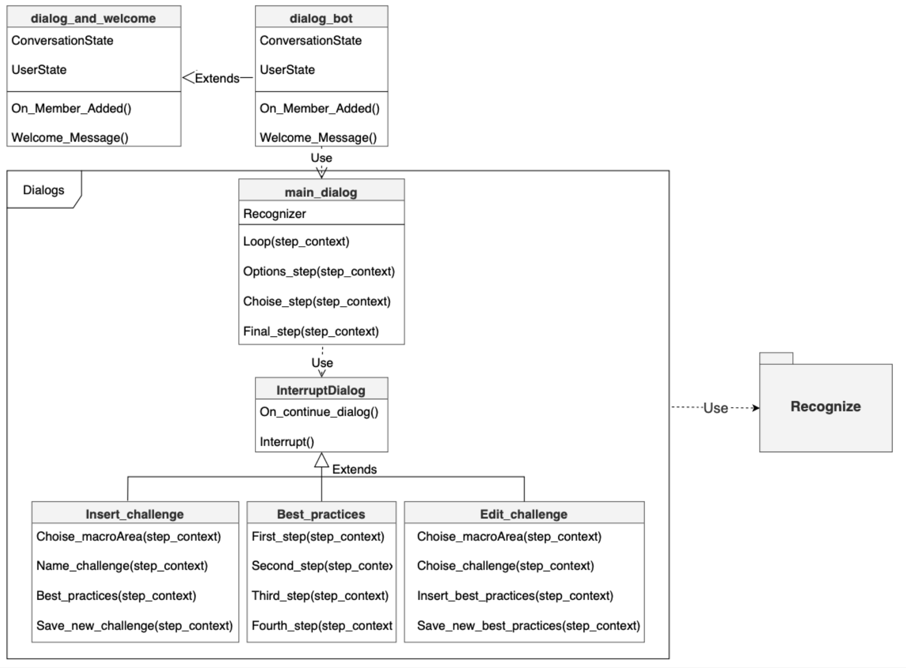

# Ola

  

Ola è un chatbot che si occupa di assistere i programmatori durante lo 
sviluppo di un bot, cercando di rispondere a quante più domande possibili.

Questo bot è stato realizzato utilizzando [Bot Framework](https://dev.botframework.com), e sono state implementate:

- Più conversazioni utilizzando i Dialogs
- Gestite le interruzioni dell'utente come "Help" o "Cancel".

## Architettura del Bot 



## Prerequisiti 

### Python
[Python](https://www.python.org/downloads/) versione 3.10.

`#Verificare la versione di pyhon -> Python --version`

## Per eseguire il Bot in locale

- Clonare il repository
```bash
git clone https://github.com/Pio57/Ola.git
```
- Apri il terminale nella cartella della del progetto clonato
- Nel terminale digirate `pip install -r requirements.txt`
- Avviare il bot con `python app.py`


## Testare il Bot 

Per testare il bot si è utilizzato [Bot Framework Emulator](https://github.com/microsoft/botframework-emulator) è un'applicazione desktop che consente agli sviluppatori di bot di testare ed eseguire il debug dei loro bot su localhost o in esecuzione in remoto attraverso un canale.

### Connettere il bot a  Bot Framework Emulator

- Avvia Bot Framework Emulator
- File -> Open Bot
- Inserisci l'URL of `http://localhost:3978/api/messages`
